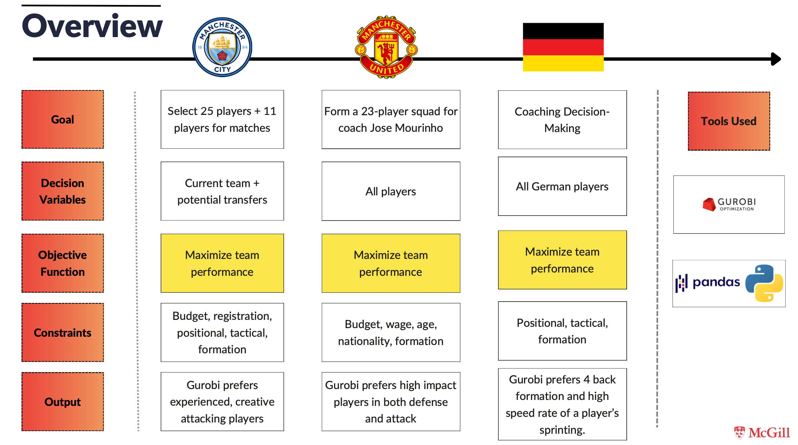
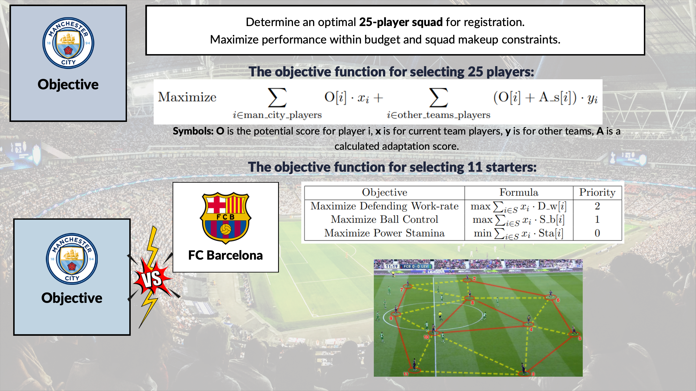
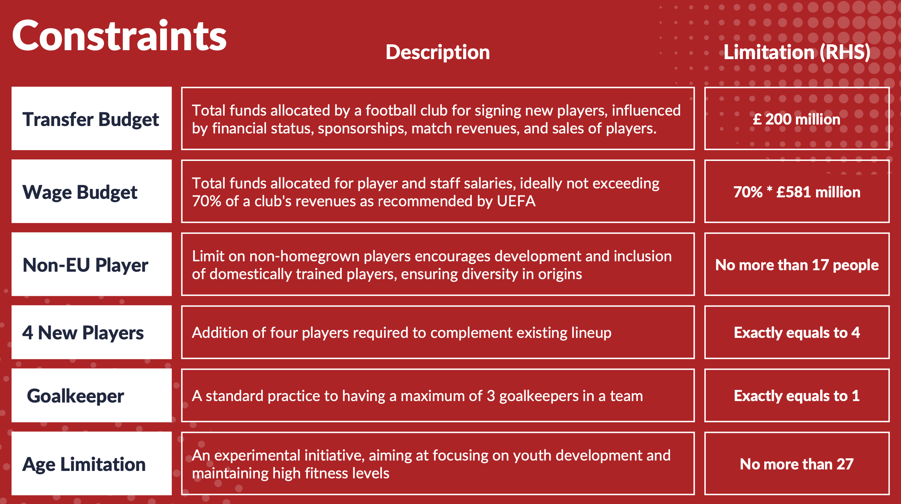
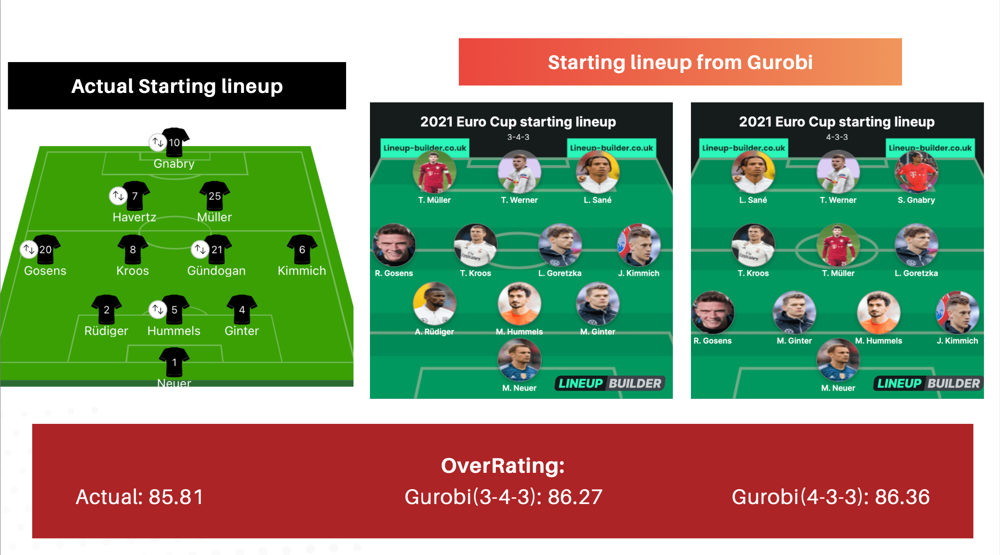

# Football Player Acquisition & Team Management Optimization

## Introduction
In the competitive arena of professional football, strategic player acquisition and management are crucial for a team's success. This project harnesses Gurobi optimization techniques to offer teams a sophisticated, data-driven framework for making informed decisions on player acquisitions, lineups, and coaches. Focusing on multiple objective optimization with a hierarchical approach and discrete optimization through Mixed-Integer Programming (MIP), the project aims to assess player selections and critically evaluate coaching decisions.

## Features
- **Player Selection and Transfers**: Optimal squad and lineup strategies for Manchester City and Manchester United (2016-2017 season).
- **Coaching Strategies**: Analyzing coaching decisions to maximize team performance, with a case study on the German national team.
- **Optimization Model**: Detailed mathematical formulations including constraints for player selection and team composition.
- **Results**: Empirical analysis comparing optimized selections with actual team performances.

## Getting Started
1. **Prerequisites**: Python, Gurobi.
2. **Data**: FIFA dataset (2014-2023) from Kaggle.
3. **Installation**: Clone the repo and install dependencies.
4. **Usage**: Run the Jupyter notebooks to execute optimization models.

## Procedure
1. **Define Objective Function**

Manchester City, a top-tier English football club, faced a pivotal season in 2016-2017, marked by a transformation under the stewardship of new manager Pep Guardiola. This period represented a shift towards an innovative playing style, and our analysis centered on utilizing optimization techniques to assist Guardiola in this transitional phase. The primary goal was twofold: Firstly, to determine an optimal 25-player squad for registration, aiming to maximize the team's performance while adhering to budgetary constraints, squad composition requirements, and player acquisition limits. Secondly, the focus was on devising the best starting 11 for crucial matches, especially against formidable opponents like Barcelona and Liverpool. By applying optimization models to comprehensive player data, our objective was to strategically strengthen the team through targeted transfers, thereby setting the stage for Guardiola to achieve success in the upcoming seasons.

2. **Implement Constraints**

3. **Use Gurobi Optimization**

We introduced multiple objective functions focusing on enhancing attacking capabilities for choosing the 26-player squad. Priorities include maximizing scoring proficiency, aerial accuracy for defensive players, and identifying young talents with high growth potential for the 2021 Euro Cup. For the starting 11, we proposed a more aggressive 4-3-3 formation, optimizing speed for wingers and the crossing quality of full-backs. Additionally, we provided insights into a 3-4-3 formation, emphasizing the pivotal roles of LWB and RWB, midfield defensive responsibilities, and attacking creativity. Key attributes like control, spatial awareness, and defensive acumen in central defenders are underscored. Utilizing multiple objective functions, we aimed to amplify performance in the 3-4-3 formation and scrutinize the coach's strategic utilization, thereby unlocking the team's full potential.

## Contributing
Contributions are welcome. Please read `CONTRIBUTING.md` for more details.

## Authors
- Hongyi Zhan (Team Lead)
- Oyundari Batbayar
- Jiaxuan Wang
- Siqi Wang
- Yifan Lu

## License
This project is under the MIT License - see `LICENSE.md`.

## Acknowledgments
- McGill University's MGSC 662 course team
- Gurobi Optimization
- Kaggle and sofifa.com for the FIFA dataset
